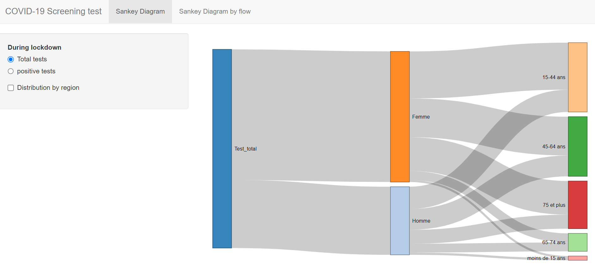
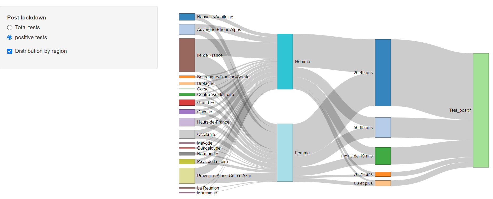
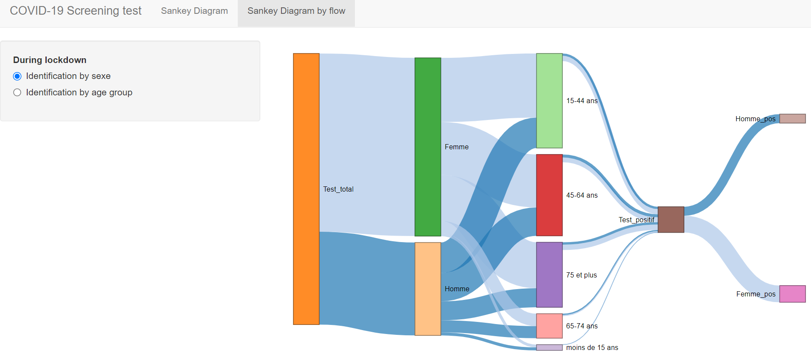
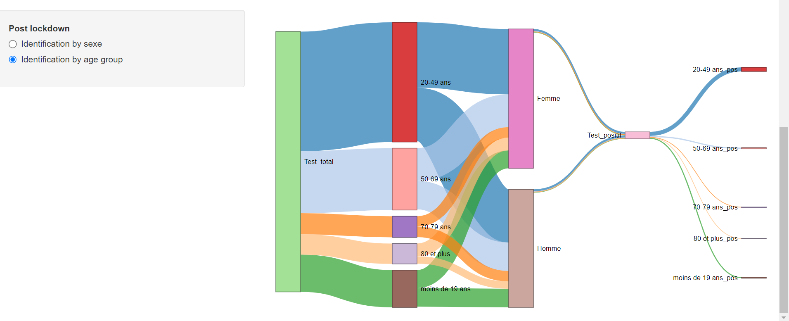

# COVID-19-Screening-test-ShinyApp
 ShinyAPP of COVID-19 Screening test

This project is about developing a shiny application to visualize France's covid-19 data using Sankey diagrams according to several socio-economic criteria (region, gender, age)

Here are screenshots of the Shiny app :

###### Sankey diagram

- Total tests per gender per age group

- Positive tests per region per gender per age group

###### Sankey diagram with flow identifiation

- Total tests per gender

- Positive tests per age groupe

